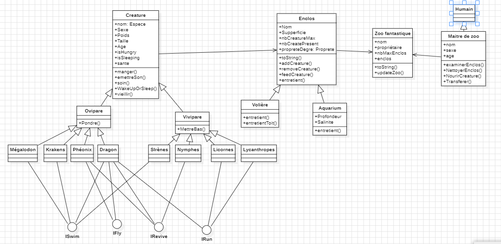
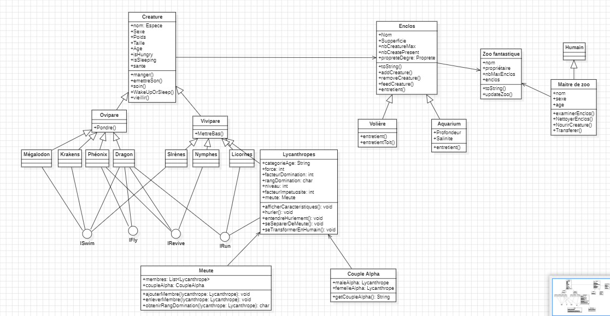

# Etude de conception Zoo Fantastique

## Sommaire

- [Etude de cas](#etude-de-cas)
- [Bilan Technique](#bilan-technique)
- [Synthèse](#synthèse)

## Etude de cas

### 1. Introduction

L'objectif de cette étude de cas est de concevoir et développer une application de simulation de zoo fantastique en Java. Le zoo fantastique doit permettre la gestion de différentes créatures, enclos et être dirigé par un maître de zoo fantastique.On doit également modéliser l'aspect temporel de la gestion du zoo avec plusieurs actions au sein du zoo.

### 2. Analyse des Besoins

#### Créatures
Représentent différentes espèces telles que lycanthropes, licornes, nymphes, krakens, sirènes, mégalodons, phénix et dragons.
Chaque créature a des caractéristiques communes : nom, sexe, poids, taille, âge, faim, sommeil, santé.
Des actions spécifiques à chaque type de créature, comme courir, nager, voler ou hurler.

#### Enclos
Contiennent des créatures du même type.
Caractéristiques : nom, superficie, capacité maximale, propreté.
Enclos spécifiques : volières et aquariums, avec des attributs supplémentaires(salinité de l'eau et l'état du toit de cage).

#### Maître de Zoo Fantastique
Gère les enclos, nourrit les créatures, nettoie les enclos, transfère les créatures.
Limitation des actions par intervalle de temps.

#### Zoo Fantastique
Possède un nom, un Maître de Zoo Fantastique, un nombre maximal d'enclos.
Doit afficher le nombre total de créatures et les créatures de tous les enclos.
Gestion temporelle pour les changements d'état aléatoires.

### 3. Conception

#### Classes Principales
- Créature : Modèle de base pour toutes les créatures.
- Classes spécifiques pour chaque type de créature (Licorne, Lycanthrope, etc.).
- Enclos : Modélise les enclos, gère les créatures à l'intérieur.
- Classes spécifiques pour les types d'enclos (Volière, Aquarium).
- MaitreZooFantastique : Représente le Maître de Zoo Fantastique.
- ZooFantastique : Classe principale du zoo, gère l'ensemble du système.

### 4. Diagramme de Classes
 

### 5. Implémentation TD4

Après avoir implémenté tout le TD3 qui était de mettre en place un ZooFantastique avec les enclos et les animaux dans celui-ci. Nous allons mettre en place le TD4 qui consiste à prendre le ZooFantastique et mettre une colonie de lycanthropes avec plusieurs aspects.

---

### 6. Analyse des Besoins

### Lycanthrope

- Représente une créature avec des caractéristiques spécifiques.
- Capacités telles que hurler, se séparer de la meute, se transformer en humain.

### Meute

- Organise les lycanthropes selon une hiérarchie stricte.
- Gère la reproduction, la formation du couple Alpha, et l'évolution naturelle de la hiérarchie.

### Colonie de Lycanthropes

- Ensemble de meutes proches, simulant une colonie.
- Gère le cycle temporel, les créations de nouvelles meutes, la saison des amours, les hurlements, les transformations.

### 7. Conception

### Classes Principales

- **Lycanthrope :** Modèle de base pour toutes les créatures.
- **Meute :** Organise les lycanthropes selon une hiérarchie stricte, gère la reproduction.
- **ColonieDeLycanthropes :** Gère l'ensemble des meutes, la simulation temporelle.

### 8. Diagramme de Classes

# Bilan Technique 

## Choix Technologiques

### Langage de Programmation

Nous avons choisi Java comme langage principal pour le développement de notre application.

### Modèle de Conception

Nous avons opté pour une approche orientée objet avec l'utilisation de classes pour modéliser les entités du zoo fantastique.Et du Model MVC pour la structure de notre code.

### Scalabilité

Le système est conçu pour être scalable en ajoutant de nouveaux types de créatures, enclos, et fonctionnalités. Cependant, une évaluation plus approfondie de la scalabilité peut être nécessaire à mesure que le nombre d'entités et d'actions augmente.

# Synthèse

En résumé le projet vise à développer une application de simulation de zoo fantastique en Java, en respectant des normes de programmation spécifiées. Le ZooFantastique doit gérer diverses créatures telles que des lycanthropes, des licornes, des nymphes, des krakens, des sirènes, des mégalodons, des phénix et des dragons. Chaque créature possède des caractéristiques communes, notamment le nom, le sexe, le poids, la taille, l'âge, l'indicateur de faim, de sommeil et de santé.

C'est même créatures peuvent effectuer différentes actions telles que manger, émettre un son, être soignées, s'endormir, se réveiller, vieillir et, dans certains cas, donner naissance.Les enclos, pouvant être standards mais aussi spécifiques avec les volières et aquariums avec la salinité de l'eau et la dégradation du toit par exemple.La gestion du ZooFantastique est assurée par un maître de ZooFantastique, capable d'effectuer des actions telles qu'examiner un enclos, nettoyer un enclos, nourrir les créatures et transférer une créature d'un enclos à un autre.

Tout est mis à disposition pour avoir la meilleure immersion possible dans ce ZooFantastique.

