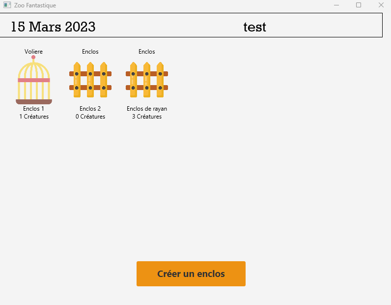
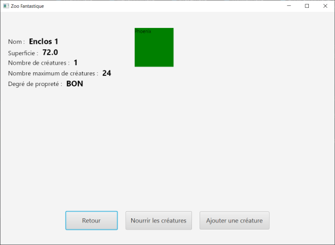

# Manuel d'Utilisation

## Bienvenue dans ZooFantastique

Pour bien commencer le ZooFantastique, je vais vous présenter les fonctionnalités présentes sur le jeu. En rentrant en détail puis dans les grandes lignes afin de vous offrir la meilleure expérience possible.

## Accueil du jeu

Pour débuter, rendez-vous sur l’accueil du jeu où vous pourrez entrer le nom de votre Zoo.

 .png)

## Exploration du Zoo

Une fois le nom entré, vous vous retrouvez dans le vif du sujet. Le zoo est à votre entière disposition, et vous seul êtes maîtres de ce Zoo.

 

Pour assurer le bon fonctionnement du Zoo, vous pouvez créer des enclos qui accueilleront les créatures fantastiques. Cependant, veillez à respecter quelques règles pour éviter l'anarchie dans le Zoo :

- Chaque enclos ne doit contenir qu'un type de créatures (kraken avec kraken, etc.).
- Pour nettoyer un enclos, transférez toutes les créatures dans un autre pour assurer leur sécurité.
- Assurez-vous de nourrir toutes les créatures pour éviter toute perte.
 

 
Des rappels apparaîtront sur votre écran pour vous indiquer quelles actions doivent être faites dans l’enceinte du Zoo.
Toutes les informations nécessaires ont été mises à votre disposition.

Lancez-vous ! Et surtout, bonne chance!
